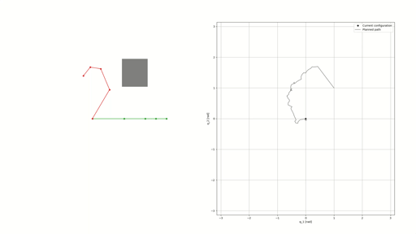

# Example code for RRT planner
- 2D robot with arbitrary number of links
- 3D robot using pyphysx library
- basic RRT planner implementation



# Installation
First create basic conda environment. Then install:


For basic 2D robot:
```bashhttps://github.com/asyraffff/readme-with-video/blob/main/README.md
conda install numpy matplotlib shapely
pip install anytree tqdm 
```


For 7D robot with pyphysics (https://github.com/petrikvladimir/pyphysx) environment:
```bash
conda install -c anaconda gcc_linux-64 gxx_linux-64
pip install pip install git+https://github.com/petrikvladimir/pyphysx.git@master
```


